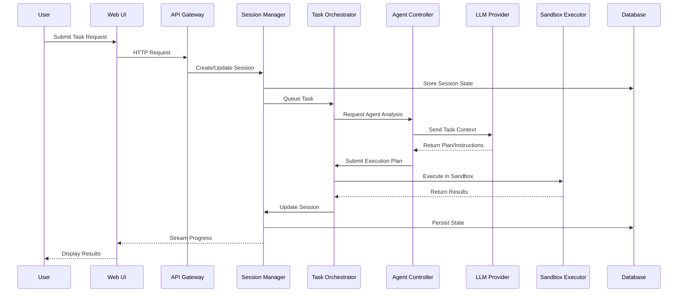

# Enhanced Technical Deep Dive: OpenHands Architecture & Implementation

## Executive Summary

This enhanced technical analysis provides comprehensive coverage of OpenHands' architecture, implementation patterns, performance characteristics, and production deployment considerations. It serves as the definitive technical reference for senior engineering leadership, solution architects, and platform teams evaluating OpenHands for enterprise adoption.

## Table of Contents

1. [System Architecture Overview](#system-architecture-overview)
2. [Core Components Deep Dive](#core-components-deep-dive)
3. [LLM Integration & Orchestration](#llm-integration--orchestration)
4. [Container Runtime & Sandbox Architecture](#container-runtime--sandbox-architecture)
5. [State Management & Persistence](#state-management--persistence)
6. [Security Architecture](#security-architecture)
7. [Performance & Scalability Analysis](#performance--scalability-analysis)
8. [Integration Patterns](#integration-patterns)
9. [Operational Considerations](#operational-considerations)
10. [Technical Risk Assessment](#technical-risk-assessment)
11. [Implementation Roadmap](#implementation-roadmap)

---

## System Architecture Overview

### High-Level Architecture

```
┌─────────────────────────────────────────────────────────────────────────────────┐
│                                 OpenHands Platform                              │
├─────────────────────────────────────────────────────────────────────────────────┤
│  Frontend Layer                                                                 │
│  ┌─────────────────┐  ┌─────────────────┐  ┌─────────────────┐               │
│  │   Web UI        │  │   CLI Interface │  │   API Gateway   │               │
│  │   (React/TS)    │  │   (Python)      │  │   (FastAPI)     │               │
│  └─────────────────┘  └─────────────────┘  └─────────────────┘               │
├─────────────────────────────────────────────────────────────────────────────────┤
│  Application Layer                                                              │
│  ┌─────────────────┐  ┌─────────────────┐  ┌─────────────────┐               │
│  │ Session Manager │  │ Task Orchestrator│  │ Agent Controller│               │
│  │ (State/Context) │  │ (Workflow Engine)│  │ (LLM Interface) │               │
│  └─────────────────┘  └─────────────────┘  └─────────────────┘               │
├─────────────────────────────────────────────────────────────────────────────────┤
│  Execution Layer                                                                │
│  ┌─────────────────┐  ┌─────────────────┐  ┌─────────────────┐               │
│  │ Sandbox Manager │  │ Code Executor   │  │ Tool Registry   │               │
│  │ (Container Mgmt)│  │ (Runtime Env)   │  │ (Plugin System) │               │
│  └─────────────────┘  └─────────────────┘  └─────────────────┘               │
├─────────────────────────────────────────────────────────────────────────────────┤
│  Infrastructure Layer                                                           │
│  ┌─────────────────┐  ┌─────────────────┐  ┌─────────────────┐               │
│  │    Database     │  │  File Storage   │  │   Monitoring    │               │
│  │ (PostgreSQL)    │  │  (Persistent)   │  │ (Metrics/Logs)  │               │
│  └─────────────────┘  └─────────────────┘  └─────────────────┘               │
└─────────────────────────────────────────────────────────────────────────────────┘

┌─────────────────────────────────────────────────────────────────────────────────┐
│                              External Integrations                              │
├─────────────────────────────────────────────────────────────────────────────────┤
│  ┌─────────────────┐  ┌─────────────────┐  ┌─────────────────┐               │
│  │  LLM Providers  │  │   Git/SCM       │  │   CI/CD         │               │
│  │ (Bedrock/OpenAI)│  │ (GitHub/GitLab) │  │ (Jenkins/GHA)   │               │
│  └─────────────────┘  └─────────────────┘  └─────────────────┘               │
└─────────────────────────────────────────────────────────────────────────────────┘
```

### Architectural Principles

#### 1. Microservices Architecture
- **Service Decomposition**: Each major component operates as an independent service
- **API-First Design**: All inter-service communication via well-defined APIs
- **Fault Isolation**: Failure in one component doesn't cascade to others
- **Independent Scaling**: Services scale based on individual load patterns

#### 2. Event-Driven Architecture
- **Asynchronous Processing**: Non-blocking task execution and state updates
- **Event Sourcing**: Complete audit trail of all system operations
- **CQRS Pattern**: Separate read/write models for optimal performance
- **Pub/Sub Messaging**: Loose coupling between components

#### 3. Container-Native Design
- **Immutable Infrastructure**: All components packaged as containers
- **Kubernetes-First**: Native support for K8s deployment patterns
- **12-Factor App**: Adherence to cloud-native application principles
- **DevOps Integration**: Built-in CI/CD and GitOps support

### Component Interaction Flow



---

## Core Components Deep Dive

### 1. Session Manager

#### Purpose & Responsibilities
- **Session Lifecycle Management**: Create, maintain, and terminate user sessions
- **Context Preservation**: Maintain conversation history and state across interactions
- **Resource Allocation**: Manage compute resources per session
- **Concurrency Control**: Handle multiple concurrent sessions safely

#### Technical Implementation

```python
# session_manager.py - Core Architecture
from typing import Dict, List, Optional, Any
from dataclasses import dataclass, field
from datetime import datetime, timedelta
import uuid
import asyncio
from enum import Enum

class SessionState(Enum):
    INITIALIZING = "initializing"
    ACTIVE = "active"
    IDLE = "idle"
    SUSPENDED = "suspended"
    TERMINATED = "terminated"
    ERROR = "error"

@dataclass
class SessionContext:
    session_id: str
    user_id: str
    workspace_path: str
    environment_config: Dict[str, Any]
    conversation_history: List[Dict[str, Any]] = field(default_factory=list)
    active_tasks: List[str] = field(default_factory=list)
    resource_limits: Dict[str, Any] = field(default_factory=dict)
    created_at: datetime = field(default_factory=datetime.utcnow)
    last_activity: datetime = field(default_factory=datetime.utcnow)
    state: SessionState = SessionState.INITIALIZING
    metadata: Dict[str, Any] = field(default_factory=dict)

class SessionManager:
    def __init__(self, config: Dict[str, Any]):
        self.config = config
        self.sessions: Dict[str, SessionContext] = {}
        self.session_locks: Dict[str, asyncio.Lock] = {}
        self.cleanup_task = None
        self.max_sessions_per_user = config.get('max_sessions_per_user', 5)
        self.session_timeout = timedelta(hours=config.get('session_timeout_hours', 2))
        self.idle_timeout = timedelta(minutes=config.get('idle_timeout_minutes', 30))
    
    async def create_session(
        self, 
        user_id: str, 
        workspace_config: Dict[str, Any],
        environment_config: Optional[Dict[str, Any]] = None
    ) -> SessionContext:
        """Create a new session with proper resource allocation"""
        
        # Check user session limits
        user_sessions = [s for s in self.sessions.values() if s.user_id == user_id]
        if len(user_sessions) >= self.max_sessions_per_user:
            # Terminate oldest idle session
            await self._cleanup_idle_sessions(user_id)
        
        session_id = str(uuid.uuid4())
        workspace_path = await self._allocate_workspace(session_id, workspace_config)
        
        session_context = SessionContext(
            session_id=session_id,
            user_id=user_id,
            workspace_path=workspace_path,
            environment_config=environment_config or {},
            resource_limits=self._calculate_resource_limits(user_id)
        )
        
        # Initialize session lock
        self.session_locks[session_id] = asyncio.Lock()
        
        # Store session
        self.sessions[session_id] = session_context
        
        # Initialize workspace and environment
        await self._initialize_session_environment(session_context)
        
        session_context.state = SessionState.ACTIVE
        
        return session_context
    
    async def get_session(self, session_id: str) -> Optional[SessionContext]:
        """Retrieve session with activity tracking"""
        session = self.sessions.get(session_id)
        if session:
            session.last_activity = datetime.utcnow()
            if session.state == SessionState.IDLE:
                session.state = SessionState.ACTIVE
        return session
    
    async def update_session_context(
        self, 
        session_id: str, 
        updates: Dict[str, Any]
    ) -> bool:
        """Thread-safe session context updates"""
        if session_id not in self.session_locks:
            return False
        
        async with self.session_locks[session_id]:
            session = self.sessions.get(session_id)
            if not session:
                return False
            
            # Apply updates
            for key, value in updates.items():
                if hasattr(session, key):
                    setattr(session, key, value)
            
            session.last_activity = datetime.utcnow()
            
            # Persist to database
            await self._persist_session_state(session)
            
            return True
    
    async def add_conversation_entry(
        self, 
        session_id: str, 
        entry: Dict[str, Any]
    ) -> bool:
        """Add entry to conversation history"""
        if session_id not in self.session_locks:
            return False
        
        async with self.session_locks[session_id]:
            session = self.sessions.get(session_id)
            if not session:
                return False
            
            # Add timestamp and sanitize entry
            entry['timestamp'] = datetime.utcnow().isoformat()
            entry = self._sanitize_conversation_entry(entry)
            
            session.conversation_history.append(entry)
            
            # Trim history if too long
            max_history = self.config.get('max_conversation_history', 100)
            if len(session.conversation_history) > max_history:
                session.conversation_history = session.conversation_history[-max_history:]
            
            session.last_activity = datetime.utcnow()
            
            return True
    
    async def terminate_session(self, session_id: str) -> bool:
        """Clean termination of session resources"""
        if session_id not in self.sessions:
            return False
        
        async with self.session_locks.get(session_id, asyncio.Lock()):
            session = self.sessions.get(session_id)
            if session:
                session.state = SessionState.TERMINATED
                
                # Cleanup resources
                await self._cleanup_session_resources(session)
                
                # Remove from active sessions
                del self.sessions[session_id]
                
                # Remove lock
                if session_id in self.session_locks:
                    del self.session_locks[session_id]
                
                return True
        
        return False
    
    async def _initialize_session_environment(self, session: SessionContext) -> None:
        """Initialize the session's execution environment"""
        # Create workspace directory structure
        workspace_init = WorkspaceInitializer(session.workspace_path)
        await workspace_init.setup_workspace(session.environment_config)
        
        # Initialize container environment
        container_manager = ContainerManager()
        await container_manager.prepare_session_container(
            session.session_id, 
            session.environment_config,
            session.resource_limits
        )
        
        # Setup monitoring and logging
        await self._setup_session_monitoring(session)
    
    async def _allocate_workspace(self, session_id: str, config: Dict[str, Any]) -> str:
        """Allocate isolated workspace for session"""
        base_path = self.config.get('workspace_base_path', '/tmp/openhands_workspaces')
        session_workspace = f"{base_path}/{session_id}"
        
        # Create workspace with proper permissions
        workspace_manager = WorkspaceManager()
        await workspace_manager.create_workspace(
            session_workspace, 
            config.get('template', 'default'),
            config.get('git_repository')
        )
        
        return session_workspace
    
    def _calculate_resource_limits(self, user_id: str) -> Dict[str, Any]:
        """Calculate resource limits based on user tier and current load"""
        # This would integrate with user management system
        # For now, return default limits
        return {
            'cpu_limit': '2000m',  # 2 CPU cores
            'memory_limit': '4Gi',
            'storage_limit': '10Gi',
            'network_bandwidth': '100Mbps',
            'max_execution_time': 300,  # 5 minutes
            'max_concurrent_tasks': 3
        }
    
    def _sanitize_conversation_entry(self, entry: Dict[str, Any]) -> Dict[str, Any]:
        """Sanitize conversation entry for storage"""
        # Remove sensitive data, ensure size limits, etc.
        sanitized = {}
        
        for key, value in entry.items():
            if key in ['role', 'content', 'timestamp', 'task_id', 'metadata']:
                if isinstance(value, str) and len(value) > 10000:
                    sanitized[key] = value[:10000] + '... [truncated]'
                else:
                    sanitized[key] = value
        
        return sanitized
```

#### Session Persistence & Recovery

```python
# session_persistence.py
from typing import Dict, Any, Optional, List
import json
import asyncpg
from datetime import datetime

class SessionPersistenceManager:
    def __init__(self, database_url: str):
        self.database_url = database_url
        self.connection_pool = None
    
    async def initialize(self) -> None:
        """Initialize database connection pool"""
        self.connection_pool = await asyncpg.create_pool(
            self.database_url,
            min_size=5,
            max_size=20,
            command_timeout=60
        )
        
        # Ensure tables exist
        await self._create_tables()
    
    async def _create_tables(self) -> None:
        """Create necessary database tables"""
        async with self.connection_pool.acquire() as conn:
            await conn.execute("""
                CREATE TABLE IF NOT EXISTS sessions (
                    session_id VARCHAR(36) PRIMARY KEY,
                    user_id VARCHAR(255) NOT NULL,
                    workspace_path TEXT NOT NULL,
                    environment_config JSONB,
                    conversation_history JSONB DEFAULT '[]',
                    active_tasks TEXT[] DEFAULT '{}',
                    resource_limits JSONB,
                    state VARCHAR(20) NOT NULL,
                    metadata JSONB DEFAULT '{}',
                    created_at TIMESTAMP WITH TIME ZONE DEFAULT NOW(),
                    last_activity TIMESTAMP WITH TIME ZONE DEFAULT NOW(),
                    updated_at TIMESTAMP WITH TIME ZONE DEFAULT NOW()
                );
                
                CREATE INDEX IF NOT EXISTS idx_sessions_user_id ON sessions(user_id);
                CREATE INDEX IF NOT EXISTS idx_sessions_state ON sessions(state);
                CREATE INDEX IF NOT EXISTS idx_sessions_last_activity ON sessions(last_activity);
                
                CREATE TABLE IF NOT EXISTS session_events (
                    id BIGSERIAL PRIMARY KEY,
                    session_id VARCHAR(36) NOT NULL REFERENCES sessions(session_id) ON DELETE CASCADE,
                    event_type VARCHAR(50) NOT NULL,
                    event_data JSONB,
                    timestamp TIMESTAMP WITH TIME ZONE DEFAULT NOW()
                );
                
                CREATE INDEX IF NOT EXISTS idx_session_events_session_id ON session_events(session_id);
                CREATE INDEX IF NOT EXISTS idx_session_events_timestamp ON session_events(timestamp);
            """)
    
    async def persist_session(self, session: SessionContext) -> bool:
        """Persist session state to database"""
        try:
            async with self.connection_pool.acquire() as conn:
                await conn.execute("""
                    INSERT INTO sessions (
                        session_id, user_id, workspace_path, environment_config,
                        conversation_history, active_tasks, resource_limits,
                        state, metadata, created_at, last_activity
                    ) VALUES ($1, $2, $3, $4, $5, $6, $7, $8, $9, $10, $11)
                    ON CONFLICT (session_id) DO UPDATE SET
                        conversation_history = EXCLUDED.conversation_history,
                        active_tasks = EXCLUDED.active_tasks,
                        state = EXCLUDED.state,
                        metadata = EXCLUDED.metadata,
                        last_activity = EXCLUDED.last_activity,
                        updated_at = NOW()
                """,
                    session.session_id,
                    session.user_id,
                    session.workspace_path,
                    json.dumps(session.environment_config),
                    json.dumps(session.conversation_history),
                    session.active_tasks,
                    json.dumps(session.resource_limits),
                    session.state.value,
                    json.dumps(session.metadata),
                    session.created_at,
                    session.last_activity
                )
                return True
        except Exception as e:
            print(f"Failed to persist session {session.session_id}: {e}")
            return False
    
    async def load_session(self, session_id: str) -> Optional[SessionContext]:
        """Load session from database"""
        try:
            async with self.connection_pool.acquire() as conn:
                row = await conn.fetchrow("""
                    SELECT * FROM sessions WHERE session_id = $1
                """, session_id)
                
                if row:
                    return SessionContext(
                        session_id=row['session_id'],
                        user_id=row['user_id'],
                        workspace_path=row['workspace_path'],
                        environment_config=json.loads(row['environment_config']),
                        conversation_history=json.loads(row['conversation_history']),
                        active_tasks=list(row['active_tasks']),
                        resource_limits=json.loads(row['resource_limits']),
                        created_at=row['created_at'],
                        last_activity=row['last_activity'],
                        state=SessionState(row['state']),
                        metadata=json.loads(row['metadata'])
                    )
                return None
        except Exception as e:
            print(f"Failed to load session {session_id}: {e}")
            return None
    
    async def record_session_event(
        self, 
        session_id: str, 
        event_type: str, 
        event_data: Dict[str, Any]
    ) -> bool:
        """Record session event for auditing"""
        try:
            async with self.connection_pool.acquire() as conn:
                await conn.execute("""
                    INSERT INTO session_events (session_id, event_type, event_data)
                    VALUES ($1, $2, $3)
                """,
                    session_id,
                    event_type,
                    json.dumps(event_data)
                )
                return True
        except Exception as e:
            print(f"Failed to record session event: {e}")
            return False
    
    async def cleanup_expired_sessions(self, expiry_hours: int = 24) -> int:
        """Cleanup expired sessions"""
        try:
            async with self.connection_pool.acquire() as conn:
                result = await conn.execute("""
                    DELETE FROM sessions 
                    WHERE last_activity < NOW() - INTERVAL '%s hours'
                    AND state IN ('idle', 'terminated')
                """, expiry_hours)
                
                # Extract number of deleted rows
                deleted_count = int(result.split()[-1])
                return deleted_count
        except Exception as e:
            print(f"Failed to cleanup expired sessions: {e}")
            return 0
```

### 2. Task Orchestrator

#### Purpose & Responsibilities
- **Workflow Management**: Orchestrate complex multi-step tasks
- **Dependency Resolution**: Handle task dependencies and execution order
- **Error Handling**: Implement retry logic and error recovery
- **Resource Coordination**: Manage compute resources across tasks

#### Technical Implementation

```python
# task_orchestrator.py
from typing import Dict, List, Any, Optional, Callable, Awaitable
from dataclasses import dataclass, field
from datetime import datetime, timedelta
from enum import Enum
import asyncio
import uuid
import json
from abc import ABC, abstractmethod

class TaskStatus(Enum):
    PENDING = "pending"
    QUEUED = "queued"
    RUNNING = "running"
    COMPLETED = "completed"
    FAILED = "failed"
    RETRYING = "retrying"
    CANCELLED = "cancelled"
    TIMEOUT = "timeout"

class TaskPriority(Enum):
    LOW = 1
    NORMAL = 2
    HIGH = 3
    CRITICAL = 4

@dataclass
class TaskExecution:
    task_id: str
    session_id: str
    task_type: str
    task_data: Dict[str, Any]
    status: TaskStatus = TaskStatus.PENDING
    priority: TaskPriority = TaskPriority.NORMAL
    dependencies: List[str] = field(default_factory=list)
    retry_count: int = 0
    max_retries: int = 3
    timeout_seconds: int = 300
    created_at: datetime = field(default_factory=datetime.utcnow)
    started_at: Optional[datetime] = None
    completed_at: Optional[datetime] = None
    result: Optional[Dict[str, Any]] = None
    error: Optional[str] = None
    metadata: Dict[str, Any] = field(default_factory=dict)
    progress_callback: Optional[Callable[[Dict[str, Any]], Awaitable[None]]] = None

class TaskExecutor(ABC):
    """Abstract base class for task executors"""
    
    @abstractmethod
    async def execute(
        self, 
        task: TaskExecution, 
        context: Dict[str, Any]
    ) -> Dict[str, Any]:
        """Execute a task and return results"""
        pass
    
    @abstractmethod
    def can_handle(self, task_type: str) -> bool:
        """Check if this executor can handle the given task type"""
        pass
    
    @abstractmethod
    async def cleanup(self, task: TaskExecution) -> None:
        """Cleanup resources after task completion"""
        pass

class TaskOrchestrator:
    def __init__(self, config: Dict[str, Any]):
        self.config = config
        self.active_tasks: Dict[str, TaskExecution] = {}
        self.task_queue: asyncio.PriorityQueue = asyncio.PriorityQueue()
        self.executors: Dict[str, TaskExecutor] = {}
        self.worker_count = config.get('worker_count', 4)
        self.workers: List[asyncio.Task] = []
        self.running = False
        self.dependency_graph: Dict[str, List[str]] = {}
        self.completion_callbacks: Dict[str, List[Callable]] = {}
        
    async def start(self) -> None:
        """Start the task orchestrator"""
        if self.running:
            return
        
        self.running = True
        
        # Start worker tasks
        for i in range(self.worker_count):
            worker = asyncio.create_task(self._worker(f"worker-{i}"))
            self.workers.append(worker)
        
        print(f"Task orchestrator started with {self.worker_count} workers")
    
    async def stop(self) -> None:
        """Stop the task orchestrator"""
        if not self.running:
            return
        
        self.running = False
        
        # Cancel all workers
        for worker in self.workers:
            worker.cancel()
        
        # Wait for workers to finish
        await asyncio.gather(*self.workers, return_exceptions=True)
        
        # Cancel remaining tasks
        for task in self.active_tasks.values():
            if task.status in [TaskStatus.PENDING, TaskStatus.QUEUED, TaskStatus.RUNNING]:
                task.status = TaskStatus.CANCELLED
        
        print("Task orchestrator stopped")
    
    def register_executor(self, name: str, executor: TaskExecutor) -> None:
        """Register a task executor"""
        self.executors[name] = executor
        print(f"Registered executor: {name}")
    
    async def submit_task(
        self, 
        session_id: str,
        task_type: str,
        task_data: Dict[str, Any],
        priority: TaskPriority = TaskPriority.NORMAL,
        dependencies: Optional[List[str]] = None,
        timeout_seconds: int = 300,
        max_retries: int = 3,
        progress_callback: Optional[Callable[[Dict[str, Any]], Awaitable[None]]] = None
    ) -> str:
        """Submit a new task for execution"""
        
        task_id = str(uuid.uuid4())
        
        task = TaskExecution(
            task_id=task_id,
            session_id=session_id,
            task_type=task_type,
            task_data=task_data,
            priority=priority,
            dependencies=dependencies or [],
            timeout_seconds=timeout_seconds,
            max_retries=max_retries,
            progress_callback=progress_callback
        )
        
        # Store task
        self.active_tasks[task_id] = task
        
        # Update dependency graph
        self.dependency_graph[task_id] = task.dependencies.copy()
        
        # Check if task can be queued immediately
        if await self._can_execute_task(task):
            await self._queue_task(task)
        
        return task_id
    
    async def get_task_status(self, task_id: str) -> Optional[TaskExecution]:
        """Get current status of a task"""
        return self.active_tasks.get(task_id)
    
    async def cancel_task(self, task_id: str) -> bool:
        """Cancel a task"""
        task = self.active_tasks.get(task_id)
        if not task:
            return False
        
        if task.status in [TaskStatus.COMPLETED, TaskStatus.FAILED, TaskStatus.CANCELLED]:
            return False
        
        task.status = TaskStatus.CANCELLED
        return True
    
    async def _worker(self, worker_name: str) -> None:
        """Worker coroutine that processes tasks from the queue"""
        while self.running:
            try:
                # Get next task from queue
                priority, task_id = await asyncio.wait_for(
                    self.task_queue.get(), 
                    timeout=1.0
                )
                
                task = self.active_tasks.get(task_id)
                if not task or task.status != TaskStatus.QUEUED:
                    continue
                
                print(f"Worker {worker_name} processing task {task_id}")
                
                # Execute task
                await self._execute_task(task, worker_name)
                
                # Check for dependent tasks that can now be executed
                await self._check_dependent_tasks(task_id)
                
            except asyncio.TimeoutError:
                # No tasks available, continue
                continue
            except Exception as e:
                print(f"Worker {worker_name} error: {e}")
    
    async def _execute_task(self, task: TaskExecution, worker_name: str) -> None:
        """Execute a single task"""
        try:
            # Find appropriate executor
            executor = None
            for name, exec_instance in self.executors.items():
                if exec_instance.can_handle(task.task_type):
                    executor = exec_instance
                    break
            
            if not executor:
                raise ValueError(f"No executor found for task type: {task.task_type}")
            
            # Update task status
            task.status = TaskStatus.RUNNING
            task.started_at = datetime.utcnow()
            
            # Create execution context
            context = {
                'task_id': task.task_id,
                'session_id': task.session_id,
                'worker_name': worker_name,
                'timeout': task.timeout_seconds
            }
            
            # Execute with timeout
            try:
                result = await asyncio.wait_for(
                    executor.execute(task, context),
                    timeout=task.timeout_seconds
                )
                
                # Task completed successfully
                task.status = TaskStatus.COMPLETED
                task.result = result
                task.completed_at = datetime.utcnow()
                
                print(f"Task {task.task_id} completed successfully")
                
            except asyncio.TimeoutError:
                task.status = TaskStatus.TIMEOUT
                task.error = f"Task timed out after {task.timeout_seconds} seconds"
                print(f"Task {task.task_id} timed out")
                
            except Exception as e:
                # Task failed
                task.error = str(e)
                
                # Check if we should retry
                if task.retry_count < task.max_retries:
                    task.retry_count += 1
                    task.status = TaskStatus.RETRYING
                    
                    # Calculate retry delay (exponential backoff)
                    delay = min(2 ** task.retry_count, 60)  # Max 60 seconds
                    
                    print(f"Task {task.task_id} failed, retrying in {delay} seconds (attempt {task.retry_count}/{task.max_retries})")
                    
                    # Schedule retry
                    asyncio.create_task(self._schedule_retry(task, delay))
                else:
                    task.status = TaskStatus.FAILED
                    task.completed_at = datetime.utcnow()
                    print(f"Task {task.task_id} failed permanently: {e}")
            
            # Cleanup executor resources
            try:
                await executor.cleanup(task)
            except Exception as e:
                print(f"Executor cleanup failed for task {task.task_id}: {e}")
            
            # Call progress callback if provided
            if task.progress_callback:
                try:
                    await task.progress_callback({
                        'task_id': task.task_id,
                        'status': task.status.value,
                        'result': task.result,
                        'error': task.error
                    })
                except Exception as e:
                    print(f"Progress callback failed for task {task.task_id}: {e}")
            
            # Call completion callbacks
            await self._call_completion_callbacks(task)
            
        except Exception as e:
            task.status = TaskStatus.FAILED
            task.error = f"Unexpected error: {e}"
            task.completed_at = datetime.utcnow()
            print(f"Unexpected error executing task {task.task_id}: {e}")
    
    async def _schedule_retry(self, task: TaskExecution, delay: float) -> None:
        """Schedule a task retry after a delay"""
        await asyncio.sleep(delay)
        
        if task.status == TaskStatus.RETRYING and self.running:
            task.status = TaskStatus.QUEUED
            await self._queue_task(task)
    
    async def _can_execute_task(self, task: TaskExecution) -> bool:
        """Check if a task's dependencies are satisfied"""
        for dep_id in task.dependencies:
            dep_task = self.active_tasks.get(dep_id)
            if not dep_task or dep_task.status != TaskStatus.COMPLETED:
                return False
        return True
    
    async def _queue_task(self, task: TaskExecution) -> None:
        """Add a task to the execution queue"""
        task.status = TaskStatus.QUEUED
        # Use negative priority for min-heap behavior (higher priority = lower number)
        priority = -task.priority.value
        await self.task_queue.put((priority, task.task_id))
    
    async def _check_dependent_tasks(self, completed_task_id: str) -> None:
        """Check if any pending tasks can now be executed"""
        for task_id, task in self.active_tasks.items():
            if (task.status == TaskStatus.PENDING and 
                completed_task_id in task.dependencies and 
                await self._can_execute_task(task)):
                await self._queue_task(task)
    
    async def _call_completion_callbacks(self, task: TaskExecution) -> None:
        """Call registered completion callbacks"""
        callbacks = self.completion_callbacks.get(task.task_id, [])
        for callback in callbacks:
            try:
                await callback(task)
            except Exception as e:
                print(f"Completion callback failed for task {task.task_id}: {e}")
    
    def add_completion_callback(
        self, 
        task_id: str, 
        callback: Callable[[TaskExecution], Awaitable[None]]
    ) -> None:
        """Add a completion callback for a task"""
        if task_id not in self.completion_callbacks:
            self.completion_callbacks[task_id] = []
        self.completion_callbacks[task_id].append(callback)
    
    async def get_session_tasks(self, session_id: str) -> List[TaskExecution]:
        """Get all tasks for a session"""
        return [task for task in self.active_tasks.values() if task.session_id == session_id]
    
    async def get_task_statistics(self) -> Dict[str, Any]:
        """Get orchestrator statistics"""
        total_tasks = len(self.active_tasks)
        status_counts = {}
        
        for task in self.active_tasks.values():
            status = task.status.value
            status_counts[status] = status_counts.get(status, 0) + 1
        
        return {
            'total_tasks': total_tasks,
            'status_counts': status_counts,
            'queue_size': self.task_queue.qsize(),
            'active_workers': len([w for w in self.workers if not w.done()]),
            'executor_count': len(self.executors)
        }
```

### 3. Agent Controller

#### Purpose & Responsibilities
- **LLM Interaction Management**: Handle communication with various LLM providers
- **Prompt Engineering**: Optimize prompts for different task types and models
- **Response Processing**: Parse and validate LLM responses
- **Context Management**: Maintain conversation context and memory

#### Technical Implementation

```python
# agent_controller.py
from typing import Dict, List, Any, Optional, AsyncGenerator, Union
from dataclasses import dataclass, field
from datetime import datetime
from enum import Enum
import asyncio
import json
import time
from abc import ABC, abstractmethod

class LLMProvider(Enum):
    OPENAI = "openai"
    ANTHROPIC = "anthropic"
    BEDROCK = "bedrock"
    AZURE_OPENAI = "azure_openai"
    COHERE = "cohere"
    GOOGLE = "google"

class MessageRole(Enum):
    SYSTEM = "system"
    USER = "user"
    ASSISTANT = "assistant"
    TOOL = "tool"

@dataclass
class Message:
    role: MessageRole
    content: str
    timestamp: datetime = field(default_factory=datetime.utcnow)
    metadata: Dict[str, Any] = field(default_factory=dict)
    tool_calls: Optional[List[Dict[str, Any]]] = None
    tool_call_id: Optional[str] = None

@dataclass
class LLMResponse:
    content: str
    usage: Dict[str, int]
    model: str
    provider: LLMProvider
    finish_reason: str
    response_time: float
    tool_calls: Optional[List[Dict[str, Any]]] = None
    metadata: Dict[str, Any] = field(default_factory=dict)

class LLMAdapter(ABC):
    """Abstract base class for LLM providers"""
    
    @abstractmethod
    async def complete(
        self, 
        messages: List[Message], 
        model: str,
        **kwargs
    ) -> LLMResponse:
        """Generate completion from messages"""
        pass
    
    @abstractmethod
    async def stream_complete(
        self, 
        messages: List[Message], 
        model: str,
        **kwargs
    ) -> AsyncGenerator[str, None]:
        """Stream completion from messages"""
        pass
    
    @abstractmethod
    def get_supported_models(self) -> List[str]:
        """Get list of supported models"""
        pass
    
    @abstractmethod
    def calculate_tokens(self, messages: List[Message], model: str) -> int:
        """Estimate token count for messages"""
        pass

class BedrockAdapter(LLMAdapter):
    """AWS Bedrock LLM adapter"""
    
    def __init__(self, config: Dict[str, Any]):
        self.config = config
        self.region = config.get('region', 'us-east-1')
        self.client = None
        self._initialize_client()
    
    def _initialize_client(self):
        """Initialize Bedrock client"""
        try:
            import boto3
            self.client = boto3.client(
                'bedrock-runtime',
                region_name=self.region,
                aws_access_key_id=self.config.get('aws_access_key_id'),
                aws_secret_access_key=self.config.get('aws_secret_access_key')
            )
        except ImportError:
            raise ImportError("boto3 required for Bedrock adapter")
    
    async def complete(
        self, 
        messages: List[Message], 
        model: str,
        **kwargs
    ) -> LLMResponse:
        """Generate completion using Bedrock"""
        start_time = time.time()
        
        # Convert messages to Bedrock format
        if 'anthropic' in model:
            body = self._format_anthropic_request(messages, model, **kwargs)
        elif 'cohere' in model:
            body = self._format_cohere_request(messages, model, **kwargs)
        else:
            raise ValueError(f"Unsupported model: {model}")
        
        try:
            response = self.client.invoke_model(
                modelId=model,
                body=json.dumps(body),
                contentType='application/json',
                accept='application/json'
            )
            
            response_body = json.loads(response['body'].read())
            response_time = time.time() - start_time
            
            return self._parse_bedrock_response(
                response_body, model, response_time
            )
        
        except Exception as e:
            raise RuntimeError(f"Bedrock API error: {e}")
    
    def _format_anthropic_request(
        self, 
        messages: List[Message], 
        model: str, 
        **kwargs
    ) -> Dict[str, Any]:
        """Format request for Anthropic models"""
        
        # Extract system message
        system_message = ""
        conversation_messages = []
        
        for msg in messages:
            if msg.role == MessageRole.SYSTEM:
                system_message = msg.content
            else:
                conversation_messages.append({
                    'role': msg.role.value,
                    'content': msg.content
                })
        
        body = {
            'messages': conversation_messages,
            'max_tokens': kwargs.get('max_tokens', 4000),
            'temperature': kwargs.get('temperature', 0.7),
            'top_p': kwargs.get('top_p', 0.9),
            'anthropic_version': 'bedrock-2023-05-31'
        }
        
        if system_message:
            body['system'] = system_message
        
        return body
    
    def _format_cohere_request(
        self, 
        messages: List[Message], 
        model: str, 
        **kwargs
    ) -> Dict[str, Any]:
        """Format request for Cohere models"""
        
        # Combine all messages into a single prompt for Cohere
        prompt_parts = []
        for msg in messages:
            role_prefix = f"{msg.role.value.upper()}: "
            prompt_parts.append(role_prefix + msg.content)
        
        prompt = "\n\n".join(prompt_parts) + "\n\nASSISTANT: "
        
        return {
            'prompt': prompt,
            'max_tokens': kwargs.get('max_tokens', 4000),
            'temperature': kwargs.get('temperature', 0.7),
            'p': kwargs.get('top_p', 0.9),
            'stop_sequences': kwargs.get('stop_sequences', ["\n\nUSER:"])
        }
    
    def _parse_bedrock_response(
        self, 
        response_body: Dict[str, Any], 
        model: str, 
        response_time: float
    ) -> LLMResponse:
        """Parse Bedrock response"""
        
        if 'anthropic' in model:
            content = response_body.get('content', [{}])[0].get('text', '')
            usage = {
                'prompt_tokens': response_body.get('usage', {}).get('input_tokens', 0),
                'completion_tokens': response_body.get('usage', {}).get('output_tokens', 0),
                'total_tokens': (
                    response_body.get('usage', {}).get('input_tokens', 0) +
                    response_body.get('usage', {}).get('output_tokens', 0)
                )
            }
            finish_reason = response_body.get('stop_reason', 'unknown')
        
        elif 'cohere' in model:
            content = response_body.get('generations', [{}])[0].get('text', '')
            usage = {
                'prompt_tokens': response_body.get('prompt_tokens', 0),
                'completion_tokens': response_body.get('generations', [{}])[0].get('token_count', 0),
                'total_tokens': (
                    response_body.get('prompt_tokens', 0) +
                    response_body.get('generations', [{}])[0].get('token_count', 0)
                )
            }
            finish_reason = response_body.get('generations', [{}])[0].get('finish_reason', 'unknown')
        
        else:
            raise ValueError(f"Unknown model format: {model}")
        
        return LLMResponse(
            content=content,
            usage=usage,
            model=model,
            provider=LLMProvider.BEDROCK,
            finish_reason=finish_reason,
            response_time=response_time,
            metadata=response_body
        )
    
    async def stream_complete(
        self, 
        messages: List[Message], 
        model: str,
        **kwargs
    ) -> AsyncGenerator[str, None]:
        """Stream completion using Bedrock"""
        # Bedrock streaming implementation would go here
        # For now, fall back to regular completion
        response = await self.complete(messages, model, **kwargs)
        yield response.content
    
    def get_supported_models(self) -> List[str]:
        """Get list of supported Bedrock models"""
        return [
            'anthropic.claude-3-sonnet-20240229-v1:0',
            'anthropic.claude-3-haiku-20240307-v1:0',
            'anthropic.claude-v2:1',
            'cohere.command-r-plus-v1:0',
            'cohere.command-r-v1:0'
        ]
    
    def calculate_tokens(self, messages: List[Message], model: str) -> int:
        """Estimate token count for Bedrock models"""
        # Simple estimation - would use tiktoken or similar for accurate counting
        total_chars = sum(len(msg.content) for msg in messages)
        return int(total_chars / 4)  # Rough estimate: 4 chars per token

class AgentController:
    def __init__(self, config: Dict[str, Any]):
        self.config = config
        self.adapters: Dict[LLMProvider, LLMAdapter] = {}
        self.default_provider = LLMProvider(config.get('default_provider', 'bedrock'))
        self.default_model = config.get('default_model', 'anthropic.claude-3-sonnet-20240229-v1:0')
        self.conversation_memory: Dict[str, List[Message]] = {}
        self.token_usage_tracker = TokenUsageTracker()
        self.prompt_templates = PromptTemplateManager()
        
        # Initialize adapters
        self._initialize_adapters()
    
    def _initialize_adapters(self) -> None:
        """Initialize LLM adapters based on configuration"""
        
        # Initialize Bedrock adapter if configured
        if 'bedrock' in self.config:
            self.adapters[LLMProvider.BEDROCK] = BedrockAdapter(self.config['bedrock'])
        
        # Initialize other adapters as needed
        # OpenAI, Anthropic, etc.
    
    async def process_task(
        self, 
        session_id: str,
        task_description: str,
        context: Optional[Dict[str, Any]] = None,
        model: Optional[str] = None,
        provider: Optional[LLMProvider] = None
    ) -> Dict[str, Any]:
        """Process a task using the appropriate LLM"""
        
        # Use defaults if not specified
        provider = provider or self.default_provider
        model = model or self.default_model
        
        # Get or create conversation history
        if session_id not in self.conversation_memory:
            self.conversation_memory[session_id] = []
        
        conversation = self.conversation_memory[session_id]
        
        # Build messages for LLM
        messages = await self._build_messages(
            task_description, 
            conversation, 
            context
        )
        
        # Get adapter
        adapter = self.adapters.get(provider)
        if not adapter:
            raise ValueError(f"No adapter available for provider: {provider}")
        
        try:
            # Generate response
            response = await adapter.complete(
                messages, 
                model,
                max_tokens=self.config.get('max_tokens', 4000),
                temperature=self.config.get('temperature', 0.7)
            )
            
            # Track token usage
            self.token_usage_tracker.record_usage(
                session_id, 
                model, 
                response.usage
            )
            
            # Update conversation memory
            user_message = Message(
                role=MessageRole.USER,
                content=task_description
            )
            assistant_message = Message(
                role=MessageRole.ASSISTANT,
                content=response.content
            )
            
            conversation.extend([user_message, assistant_message])
            
            # Trim conversation if too long
            max_history = self.config.get('max_conversation_length', 50)
            if len(conversation) > max_history:
                # Keep system message and trim from the middle
                system_messages = [msg for msg in conversation if msg.role == MessageRole.SYSTEM]
                other_messages = [msg for msg in conversation if msg.role != MessageRole.SYSTEM]
                trimmed_messages = other_messages[-max_history:]
                conversation[:] = system_messages + trimmed_messages
            
            # Parse response for structured data
            parsed_response = await self._parse_agent_response(response.content)
            
            return {
                'success': True,
                'response': response.content,
                'parsed_response': parsed_response,
                'usage': response.usage,
                'model': model,
                'provider': provider.value,
                'response_time': response.response_time
            }
        
        except Exception as e:
            return {
                'success': False,
                'error': str(e),
                'model': model,
                'provider': provider.value
            }
    
    async def _build_messages(
        self, 
        task_description: str,
        conversation: List[Message],
        context: Optional[Dict[str, Any]] = None
    ) -> List[Message]:
        """Build message list for LLM request"""
        
        messages = []
        
        # Add system message
        system_prompt = await self.prompt_templates.get_system_prompt(
            task_type='general',
            context=context
        )
        
        messages.append(Message(
            role=MessageRole.SYSTEM,
            content=system_prompt
        ))
        
        # Add conversation history (keep recent messages)
        recent_conversation = conversation[-20:]  # Last 20 messages
        messages.extend(recent_conversation)
        
        # Add current task
        task_prompt = await self.prompt_templates.format_task_prompt(
            task_description,
            context
        )
        
        messages.append(Message(
            role=MessageRole.USER,
            content=task_prompt
        ))
        
        return messages
    
    async def _parse_agent_response(self, response: str) -> Dict[str, Any]:
        """Parse agent response for structured data"""
        
        try:
            # Look for JSON blocks in response
            import re
            json_pattern = r'```json\s*({.*?})\s*```'
            json_matches = re.findall(json_pattern, response, re.DOTALL)
            
            parsed_data = {}
            
            if json_matches:
                # Parse the first JSON block found
                json_data = json.loads(json_matches[0])
                parsed_data['structured_data'] = json_data
            
            # Extract code blocks
            code_pattern = r'```(\w+)?\s*([^`]+)\s*```'
            code_matches = re.findall(code_pattern, response, re.DOTALL)
            
            if code_matches:
                parsed_data['code_blocks'] = [
                    {
                        'language': match[0] or 'text',
                        'code': match[1].strip()
                    }
                    for match in code_matches
                ]
            
            # Extract action items or commands
            action_pattern = r'(?:ACTION|COMMAND|TODO):\s*(.+?)(?:\n|$)'
            action_matches = re.findall(action_pattern, response, re.IGNORECASE)
            
            if action_matches:
                parsed_data['actions'] = [action.strip() for action in action_matches]
            
            return parsed_data
        
        except Exception as e:
            return {'parse_error': str(e)}
    
    async def stream_response(
        self,
        session_id: str,
        task_description: str,
        context: Optional[Dict[str, Any]] = None,
        model: Optional[str] = None,
        provider: Optional[LLMProvider] = None
    ) -> AsyncGenerator[Dict[str, Any], None]:
        """Stream response from LLM"""
        
        provider = provider or self.default_provider
        model = model or self.default_model
        
        # Get conversation history
        conversation = self.conversation_memory.get(session_id, [])
        
        # Build messages
        messages = await self._build_messages(
            task_description, 
            conversation, 
            context
        )
        
        # Get adapter
        adapter = self.adapters.get(provider)
        if not adapter:
            yield {'error': f'No adapter available for provider: {provider}'}
            return
        
        try:
            async for chunk in adapter.stream_complete(messages, model):
                yield {
                    'type': 'content',
                    'content': chunk,
                    'model': model,
                    'provider': provider.value
                }
        
        except Exception as e:
            yield {
                'type': 'error',
                'error': str(e),
                'model': model,
                'provider': provider.value
            }
    
    def get_session_usage(self, session_id: str) -> Dict[str, Any]:
        """Get token usage statistics for a session"""
        return self.token_usage_tracker.get_session_usage(session_id)
    
    def clear_session_memory(self, session_id: str) -> None:
        """Clear conversation memory for a session"""
        if session_id in self.conversation_memory:
            del self.conversation_memory[session_id]
    
    async def get_available_models(self, provider: Optional[LLMProvider] = None) -> Dict[str, List[str]]:
        """Get available models for providers"""
        if provider:
            adapter = self.adapters.get(provider)
            if adapter:
                return {provider.value: adapter.get_supported_models()}
            return {}
        
        # Return all available models
        all_models = {}
        for prov, adapter in self.adapters.items():
            all_models[prov.value] = adapter.get_supported_models()
        
        return all_models

class TokenUsageTracker:
    """Track token usage across sessions and models"""
    
    def __init__(self):
        self.usage_data: Dict[str, Dict[str, Dict[str, int]]] = {}
    
    def record_usage(
        self, 
        session_id: str, 
        model: str, 
        usage: Dict[str, int]
    ) -> None:
        """Record token usage for a session and model"""
        if session_id not in self.usage_data:
            self.usage_data[session_id] = {}
        
        if model not in self.usage_data[session_id]:
            self.usage_data[session_id][model] = {
                'prompt_tokens': 0,
                'completion_tokens': 0,
                'total_tokens': 0,
                'requests': 0
            }
        
        model_usage = self.usage_data[session_id][model]
        model_usage['prompt_tokens'] += usage.get('prompt_tokens', 0)
        model_usage['completion_tokens'] += usage.get('completion_tokens', 0)
        model_usage['total_tokens'] += usage.get('total_tokens', 0)
        model_usage['requests'] += 1
    
    def get_session_usage(self, session_id: str) -> Dict[str, Any]:
        """Get usage statistics for a session"""
        session_data = self.usage_data.get(session_id, {})
        
        total_usage = {
            'prompt_tokens': 0,
            'completion_tokens': 0,
            'total_tokens': 0,
            'requests': 0
        }
        
        for model_usage in session_data.values():
            total_usage['prompt_tokens'] += model_usage['prompt_tokens']
            total_usage['completion_tokens'] += model_usage['completion_tokens']
            total_usage['total_tokens'] += model_usage['total_tokens']
            total_usage['requests'] += model_usage['requests']
        
        return {
            'total_usage': total_usage,
            'by_model': session_data
        }

class PromptTemplateManager:
    """Manage prompt templates for different task types"""
    
    def __init__(self):
        self.templates = {
            'system': {
                'general': """
You are OpenHands, an advanced AI software development assistant. You help developers with coding tasks, debugging, architecture design, and general software development questions.

Key capabilities:
- Write, debug, and optimize code in multiple programming languages
- Design software architectures and provide technical recommendations
- Explain complex technical concepts clearly
- Help with DevOps, deployment, and infrastructure tasks
- Review code for quality, security, and performance issues

Guidelines:
- Provide clear, actionable responses
- Include code examples when appropriate
- Consider security, performance, and maintainability
- Ask clarifying questions when requirements are unclear
- Explain your reasoning and approach

Context: {context}
""",
                'debugging': """
You are OpenHands, specialized in debugging and troubleshooting software issues. Your role is to help identify root causes of problems and provide effective solutions.

Approach:
1. Analyze the provided error messages, logs, or symptoms
2. Identify potential root causes
3. Suggest systematic debugging steps
4. Provide specific fixes or workarounds
5. Recommend preventive measures

Context: {context}
""",
                'architecture': """
You are OpenHands, an expert software architect. Help design scalable, maintainable, and efficient software systems.

Considerations:
- System requirements and constraints
- Scalability and performance needs
- Technology stack appropriateness
- Security and compliance requirements
- Maintainability and team capabilities
- Cost and operational complexity

Context: {context}
"""
            },
            'task': {
                'default': """
Task: {task_description}

{context_info}

Please provide a comprehensive response that addresses the task requirements. Include:
- Clear explanations of your approach
- Code examples if applicable
- Best practices and considerations
- Any assumptions or clarifications needed
"""
            }
        }
    
    async def get_system_prompt(
        self, 
        task_type: str = 'general', 
        context: Optional[Dict[str, Any]] = None
    ) -> str:
        """Get system prompt for task type"""
        template = self.templates['system'].get(task_type, self.templates['system']['general'])
        
        context_str = ""
        if context:
            context_str = "\n".join([f"{k}: {v}" for k, v in context.items()])
        
        return template.format(context=context_str)
    
    async def format_task_prompt(
        self, 
        task_description: str, 
        context: Optional[Dict[str, Any]] = None
    ) -> str:
        """Format task prompt with context"""
        template = self.templates['task']['default']
        
        context_info = ""
        if context:
            context_info = "Context:\n" + "\n".join([f"- {k}: {v}" for k, v in context.items()])
        
        return template.format(
            task_description=task_description,
            context_info=context_info
        )
```

---

## Container Runtime & Sandbox Architecture

### Sandbox Security Model

#### Multi-Layer Security Architecture

```
┌─────────────────────────────────────────────────────────────────────────────────┐
│                            Host Operating System                                │
├─────────────────────────────────────────────────────────────────────────────────┤
│  Container Runtime Layer (Podman/Docker)                                       │
│  ┌─────────────────┐  ┌─────────────────┐  ┌─────────────────┐               │
│  │   Namespace     │  │   Cgroups       │  │   Capabilities  │               │
│  │   Isolation     │  │   Resource      │  │   Restrictions  │               │
│  │   (PID, Net,    │  │   Limits        │  │   (Drop ALL,    │               │
│  │    Mount, UTS)  │  │   (CPU, Memory) │  │    Add Minimal) │               │
│  └─────────────────┘  └─────────────────┘  └─────────────────┘               │
├─────────────────────────────────────────────────────────────────────────────────┤
│  Security Policy Layer                                                          │
│  ┌─────────────────┐  ┌─────────────────┐  ┌─────────────────┐               │
│  │   Seccomp       │  │   AppArmor/     │  │   Network       │               │
│  │   Syscall       │  │   SELinux       │  │   Policies      │               │
│  │   Filtering     │  │   MAC Controls  │  │   (Firewall)    │               │
│  └─────────────────┘  └─────────────────┘  └─────────────────┘               │
├─────────────────────────────────────────────────────────────────────────────────┤
│  Application Sandbox                                                            │
│  ┌─────────────────────────────────────────────────────────────────────────┐   │
│  │                    OpenHands Execution Environment                     │   │
│  │  ┌─────────────┐  ┌─────────────┐  ┌─────────────┐  ┌─────────────┐   │   │
│  │  │   Python    │  │   Node.js   │  │   Git       │  │   Shell     │   │   │
│  │  │   Runtime   │  │   Runtime   │  │   Tools     │  │   Utilities │   │   │
│  │  └─────────────┘  └─────────────┘  └─────────────┘  └─────────────┘   │   │
│  │                                                                       │   │
│  │  ┌─────────────────────────────────────────────────────────────────┐ │   │
│  │  │                    Workspace Volume                             │ │   │
│  │  │  ┌─────────────┐  ┌─────────────┐  ┌─────────────┐             │ │   │
│  │  │  │   Source    │  │   Build     │  │   Output    │             │ │   │
│  │  │  │   Files     │  │   Artifacts │  │   Files     │             │ │   │
│  │  │  └─────────────┘  └─────────────┘  └─────────────┘             │ │   │
│  │  └─────────────────────────────────────────────────────────────────┘ │   │
│  └─────────────────────────────────────────────────────────────────────────┘   │
└─────────────────────────────────────────────────────────────────────────────────┘
```

#### Container Security Implementation

```python
# sandbox_manager.py
from typing import Dict, List, Any, Optional
from dataclasses import dataclass
from datetime import datetime, timedelta
import asyncio
import subprocess
import json
import tempfile
import os
import shutil
from pathlib import Path

@dataclass
class SandboxConfig:
    session_id: str
    workspace_path: str
    resource_limits: Dict[str, Any]
    network_config: Dict[str, Any]
    security_config: Dict[str, Any]
    runtime_config: Dict[str, Any]
    timeout_seconds: int = 300
    
class SandboxManager:
    def __init__(self, config: Dict[str, Any]):
        self.config = config
        self.active_sandboxes: Dict[str, Dict[str, Any]] = {}
        self.runtime = config.get('runtime', 'podman')  # podman or docker
        self.base_image = config.get('base_image', 'docker.all-hands.dev/all-hands-ai/runtime:latest')
        self.network_name = config.get('network_name', 'openhands-sandbox')
        self.temp_dir = config.get('temp_dir', '/tmp/openhands-sandboxes')
        
        # Ensure temp directory exists
        Path(self.temp_dir).mkdir(parents=True, exist_ok=True)
    
    async def create_sandbox(self, sandbox_config: SandboxConfig) -> str:
        """Create a new isolated sandbox environment"""
        
        container_name = f"openhands-{sandbox_config.session_id}"
        
        try:
            # Prepare workspace
            workspace_path = await self._prepare_workspace(sandbox_config)
            
            # Generate security policies
            security_files = await self._generate_security_policies(sandbox_config)
            
            # Build container run command
            run_command = await self._build_run_command(
                container_name,
                workspace_path,
                sandbox_config,
                security_files
            )
            
            # Start container
            process = await asyncio.create_subprocess_exec(
                *run_command,
                stdout=asyncio.subprocess.PIPE,
                stderr=asyncio.subprocess.PIPE
            )
            
            stdout, stderr = await process.communicate()
            
            if process.returncode != 0:
                raise RuntimeError(f"Failed to start sandbox: {stderr.decode()}")
            
            container_id = stdout.decode().strip()
            
            # Store sandbox info
            self.active_sandboxes[sandbox_config.session_id] = {
                'container_id': container_id,
                'container_name': container_name,
                'workspace_path': workspace_path,
                'created_at': datetime.utcnow(),
                'config': sandbox_config,
                'security_files': security_files
            }
            
            # Wait for container to be ready
            await self._wait_for_container_ready(container_id)
            
            return container_id
        
        except Exception as e:
            # Cleanup on failure
            await self._cleanup_failed_sandbox(container_name, sandbox_config.session_id)
            raise RuntimeError(f"Sandbox creation failed: {e}")
    
    async def execute_command(
        self, 
        session_id: str, 
        command: str,
        working_dir: str = "/workspace",
        timeout: Optional[int] = None
    ) -> Dict[str, Any]:
        """Execute command in sandbox"""
        
        sandbox_info = self.active_sandboxes.get(session_id)
        if not sandbox_info:
            raise ValueError(f"No active sandbox for session: {session_id}")
        
        container_id = sandbox_info['container_id']
        timeout = timeout or sandbox_info['config'].timeout_seconds
        
        # Build exec command
        exec_command = [
            self.runtime, 'exec',
            '-w', working_dir,
            container_id,
            '/bin/bash', '-c', command
        ]
        
        start_time = datetime.utcnow()
        
        try:
            # Execute with timeout
            process = await asyncio.create_subprocess_exec(
                *exec_command,
                stdout=asyncio.subprocess.PIPE,
                stderr=asyncio.subprocess.PIPE
            )
            
            stdout, stderr = await asyncio.wait_for(
                process.communicate(),
                timeout=timeout
            )
            
            end_time = datetime.utcnow()
            execution_time = (end_time - start_time).total_seconds()
            
            return {
                'success': process.returncode == 0,
                'returncode': process.returncode,
                'stdout': stdout.decode('utf-8', errors='replace'),
                'stderr': stderr.decode('utf-8', errors='replace'),
                'execution_time': execution_time,
                'command': command,
                'working_dir': working_dir
            }
        
        except asyncio.TimeoutError:
            # Kill the process and container if timeout
            try:
                process.terminate()
                await asyncio.wait_for(process.wait(), timeout=5)
            except:
                process.kill()
            
            return {
                'success': False,
                'returncode': -1,
                'stdout': '',
                'stderr': f'Command timed out after {timeout} seconds',
                'execution_time': timeout,
                'command': command,
                'working_dir': working_dir,
                'timeout': True
            }
        
        except Exception as e:
            return {
                'success': False,
                'returncode': -1,
                'stdout': '',
                'stderr': f'Execution error: {str(e)}',
                'execution_time': 0,
                'command': command,
                'working_dir': working_dir,
                'error': str(e)
            }
    
    async def destroy_sandbox(self, session_id: str) -> bool:
        """Destroy sandbox and cleanup resources"""
        
        sandbox_info = self.active_sandboxes.get(session_id)
        if not sandbox_info:
            return False
        
        container_id = sandbox_info['container_id']
        container_name = sandbox_info['container_name']
        
        try:
            # Stop container
            stop_command = [self.runtime, 'stop', container_id]
            process = await asyncio.create_subprocess_exec(
                *stop_command,
                stdout=asyncio.subprocess.PIPE,
                stderr=asyncio.subprocess.PIPE
            )
            await process.communicate()
            
            # Remove container
            rm_command = [self.runtime, 'rm', container_id]
            process = await asyncio.create_subprocess_exec(
                *rm_command,
                stdout=asyncio.subprocess.PIPE,
                stderr=asyncio.subprocess.PIPE
            )
            await process.communicate()
            
            # Cleanup security files
            await self._cleanup_security_files(sandbox_info['security_files'])
            
            # Remove from active sandboxes
            del self.active_sandboxes[session_id]
            
            return True
        
        except Exception as e:
            print(f"Error destroying sandbox {session_id}: {e}")
            return False
    
    async def get_sandbox_stats(self, session_id: str) -> Optional[Dict[str, Any]]:
        """Get resource usage statistics for sandbox"""
        
        sandbox_info = self.active_sandboxes.get(session_id)
        if not sandbox_info:
            return None
        
        container_id = sandbox_info['container_id']
        
        try:
            # Get container stats
            stats_command = [self.runtime, 'stats', '--no-stream', '--format', 'json', container_id]
            process = await asyncio.create_subprocess_exec(
                *stats_command,
                stdout=asyncio.subprocess.PIPE,
                stderr=asyncio.subprocess.PIPE
            )
            
            stdout, stderr = await process.communicate()
            
            if process.returncode == 0:
                stats_data = json.loads(stdout.decode())
                return {
                    'cpu_percent': stats_data.get('CPUPerc', '0%'),
                    'memory_usage': stats_data.get('MemUsage', '0B / 0B'),
                    'memory_percent': stats_data.get('MemPerc', '0%'),
                    'network_io': stats_data.get('NetIO', '0B / 0B'),
                    'block_io': stats_data.get('BlockIO', '0B / 0B'),
                    'pids': stats_data.get('PIDs', '0')
                }
            
            return None
        
        except Exception as e:
            print(f"Error getting sandbox stats {session_id}: {e}")
            return None
    
    async def _prepare_workspace(self, sandbox_config: SandboxConfig) -> str:
        """Prepare workspace directory with proper permissions"""
        
        workspace_path = sandbox_config.workspace_path
        
        # Create workspace if it doesn't exist
        Path(workspace_path).mkdir(parents=True, exist_ok=True)
        
        # Set proper permissions (readable/writable by container user)
        os.chmod(workspace_path, 0o755)
        
        # Create standard subdirectories
        subdirs = ['src', 'build', 'output', 'logs']
        for subdir in subdirs:
            subdir_path = Path(workspace_path) / subdir
            subdir_path.mkdir(exist_ok=True)
            os.chmod(subdir_path, 0o755)
        
        return workspace_path
    
    async def _generate_security_policies(self, sandbox_config: SandboxConfig) -> Dict[str, str]:
        """Generate security policy files"""
        
        session_id = sandbox_config.session_id
        security_dir = Path(self.temp_dir) / f"security-{session_id}"
        security_dir.mkdir(exist_ok=True)
        
        security_files = {}
        
        # Generate Seccomp profile
        seccomp_profile = self._generate_seccomp_profile(sandbox_config.security_config)
        seccomp_file = security_dir / "seccomp.json"
        with open(seccomp_file, 'w') as f:
            json.dump(seccomp_profile, f, indent=2)
        security_files['seccomp'] = str(seccomp_file)
        
        # Generate AppArmor profile (if supported)
        if self._is_apparmor_supported():
            apparmor_profile = self._generate_apparmor_profile(sandbox_config.security_config)
            apparmor_file = security_dir / "apparmor.profile"
            with open(apparmor_file, 'w') as f:
                f.write(apparmor_profile)
            security_files['apparmor'] = str(apparmor_file)
        
        return security_files
    
    def _generate_seccomp_profile(self, security_config: Dict[str, Any]) -> Dict[str, Any]:
        """Generate Seccomp security profile"""
        
        # Base secure profile - deny by default, allow only necessary syscalls
        allowed_syscalls = [
            # File operations
            "read", "write", "open", "openat", "close", "stat", "fstat", "lstat",
            "access", "faccessat", "readlink", "readlinkat", "lseek", "dup", "dup2", "dup3",
            
            # Process control
            "fork", "vfork", "clone", "execve", "execveat", "exit", "exit_group", "wait4", "waitpid",
            
            # Memory management
            "mmap", "mmap2", "munmap", "mprotect", "madvise", "brk", "mremap",
            
            # Signal handling
            "rt_sigaction", "rt_sigprocmask", "rt_sigreturn", "sigaltstack",
            
            # Networking (limited)
            "socket", "connect", "bind", "listen", "accept", "accept4", "sendto", "recvfrom",
            "setsockopt", "getsockopt", "shutdown",
            
            # Time
            "time", "gettimeofday", "clock_gettime", "nanosleep",
            
            # Process info
            "getpid", "getppid", "getuid", "geteuid", "getgid", "getegid",
            
            # File system
            "chdir", "fchdir", "getcwd", "mkdir", "mkdirat", "rmdir", "unlink", "unlinkat",
            "rename", "renameat", "chmod", "fchmod", "fchmodat", "chown", "fchown", "fchownat",
            
            # I/O multiplexing
            "select", "pselect6", "poll", "ppoll", "epoll_create", "epoll_create1",
            "epoll_ctl", "epoll_wait", "epoll_pwait",
            
            # Pipes and FIFOs
            "pipe", "pipe2",
            
            # Basic system info
            "uname", "arch_prctl"
        ]
        
        # Additional syscalls based on security config
        if security_config.get('allow_network', False):
            allowed_syscalls.extend([
                "socket", "socketpair", "sendmsg", "recvmsg"
            ])
        
        return {
            "defaultAction": "SCMP_ACT_ERRNO",
            "archMap": [
                {
                    "architecture": "SCMP_ARCH_X86_64",
                    "subArchitectures": [
                        "SCMP_ARCH_X86",
                        "SCMP_ARCH_X32"
                    ]
                }
            ],
            "syscalls": [
                {
                    "names": allowed_syscalls,
                    "action": "SCMP_ACT_ALLOW"
                }
            ]
        }
    
    def _generate_apparmor_profile(self, security_config: Dict[str, Any]) -> str:
        """Generate AppArmor security profile"""
        
        profile_name = f"openhands-sandbox-{security_config.get('profile_id', 'default')}"
        
        return f"""
#include <tunables/global>

profile {profile_name} flags=(attach_disconnected,mediate_deleted) {{
  #include <abstractions/base>
  #include <abstractions/nameservice>
  #include <abstractions/openssl>
  #include <abstractions/ssl_certs>

  # Capabilities
  capability dac_override,
  capability setuid,
  capability setgid,
  capability net_bind_service,

  # Network access
  network inet tcp,
  network inet udp,
  network inet6 tcp,
  network inet6 udp,

  # File system access (restricted to workspace)
  /workspace/** rw,
  /tmp/** rw,
  /var/tmp/** rw,
  
  # System binaries (read-only)
  /bin/** ix,
  /usr/bin/** ix,
  /usr/local/bin/** ix,
  /sbin/** ix,
  /usr/sbin/** ix,
  
  # Libraries (read-only)
  /lib/** r,
  /usr/lib/** r,
  /usr/local/lib/** r,
  
  # Python runtime
  /usr/bin/python* ix,
  /usr/lib/python*/** r,
  /usr/local/lib/python*/** r,
  
  # Node.js runtime
  /usr/bin/node ix,
  /usr/lib/node_modules/** r,
  
  # Deny dangerous operations
  deny /etc/passwd w,
  deny /etc/shadow rw,
  deny /etc/group w,
  deny /proc/sys/kernel/** rw,
  deny /sys/** w,
  deny mount,
  deny umount,
  deny ptrace,
  deny signal,
  deny capability sys_admin,
  deny capability sys_module,
  deny capability sys_rawio,
  
  # Specific denials for container escape attempts
  deny /proc/*/root/** rw,
  deny /proc/*/cwd rw,
  deny /proc/*/exe rw,
  deny /dev/mem rw,
  deny /dev/kmem rw,
  deny /dev/port rw,
}}
"""
    
    def _is_apparmor_supported(self) -> bool:
        """Check if AppArmor is supported on the system"""
        return Path('/sys/module/apparmor').exists()
    
    async def _build_run_command(
        self,
        container_name: str,
        workspace_path: str,
        sandbox_config: SandboxConfig,
        security_files: Dict[str, str]
    ) -> List[str]:
        """Build container run command with security settings"""
        
        cmd = [
            self.runtime, 'run',
            '-d',  # Detached
            '--name', container_name,
            '--rm',  # Remove on exit
        ]
        
        # Resource limits
        limits = sandbox_config.resource_limits
        if 'cpu_limit' in limits:
            cmd.extend(['--cpus', str(limits['cpu_limit'])])
        if 'memory_limit' in limits:
            cmd.extend(['--memory', str(limits['memory_limit'])])
        if 'pids_limit' in limits:
            cmd.extend(['--pids-limit', str(limits['pids_limit'])])
        
        # Security settings
        cmd.extend([
            '--security-opt', 'no-new-privileges:true',
            '--cap-drop', 'ALL',
            '--cap-add', 'NET_BIND_SERVICE',
            '--cap-add', 'SETUID',
            '--cap-add', 'SETGID',
            '--read-only',
            '--tmpfs', '/tmp:noexec,nosuid,size=100m',
            '--tmpfs', '/var/tmp:noexec,nosuid,size=100m'
        ])
        
        # Seccomp profile
        if 'seccomp' in security_files:
            cmd.extend(['--security-opt', f'seccomp={security_files["seccomp"]}'])
        
        # AppArmor profile
        if 'apparmor' in security_files:
            cmd.extend(['--security-opt', f'apparmor={security_files["apparmor"]}'])
        
        # Network configuration
        network_config = sandbox_config.network_config
        if network_config.get('isolated', True):
            cmd.extend(['--network', 'none'])
        elif network_config.get('custom_network'):
            cmd.extend(['--network', network_config['custom_network']])
        
        # Volume mounts
        cmd.extend([
            '-v', f'{workspace_path}:/workspace:rw',
        ])
        
        # Environment variables
        runtime_config = sandbox_config.runtime_config
        for key, value in runtime_config.get('environment', {}).items():
            cmd.extend(['-e', f'{key}={value}'])
        
        # Working directory
        cmd.extend(['-w', '/workspace'])
        
        # Image
        cmd.append(self.base_image)
        
        # Command (keep container running)
        cmd.extend(['sleep', 'infinity'])
        
        return cmd
    
    async def _wait_for_container_ready(self, container_id: str, timeout: int = 30) -> None:
        """Wait for container to be ready"""
        start_time = datetime.utcnow()
        
        while (datetime.utcnow() - start_time).total_seconds() < timeout:
            try:
                # Check if container is running
                inspect_command = [self.runtime, 'inspect', container_id]
                process = await asyncio.create_subprocess_exec(
                    *inspect_command,
                    stdout=asyncio.subprocess.PIPE,
                    stderr=asyncio.subprocess.PIPE
                )
                
                stdout, stderr = await process.communicate()
                
                if process.returncode == 0:
                    inspect_data = json.loads(stdout.decode())
                    if inspect_data[0]['State']['Running']:
                        # Container is running, test basic functionality
                        test_command = [self.runtime, 'exec', container_id, 'echo', 'ready']
                        test_process = await asyncio.create_subprocess_exec(
                            *test_command,
                            stdout=asyncio.subprocess.PIPE,
                            stderr=asyncio.subprocess.PIPE
                        )
                        
                        test_stdout, test_stderr = await test_process.communicate()
                        
                        if test_process.returncode == 0 and 'ready' in test_stdout.decode():
                            return  # Container is ready
                
                await asyncio.sleep(1)
            
            except Exception:
                await asyncio.sleep(1)
        
        raise TimeoutError(f"Container {container_id} not ready within {timeout} seconds")
    
    async def _cleanup_failed_sandbox(self, container_name: str, session_id: str) -> None:
        """Cleanup resources after failed sandbox creation"""
        try:
            # Try to remove container if it exists
            rm_command = [self.runtime, 'rm', '-f', container_name]
            process = await asyncio.create_subprocess_exec(
                *rm_command,
                stdout=asyncio.subprocess.PIPE,
                stderr=asyncio.subprocess.PIPE
            )
            await process.communicate()
            
            # Cleanup security files
            security_dir = Path(self.temp_dir) / f"security-{session_id}"
            if security_dir.exists():
                shutil.rmtree(security_dir)
        
        except Exception as e:
            print(f"Error during cleanup: {e}")
    
    async def _cleanup_security_files(self, security_files: Dict[str, str]) -> None:
        """Cleanup generated security files"""
        for file_path in security_files.values():
            try:
                if Path(file_path).exists():
                    Path(file_path).unlink()
            except Exception as e:
                print(f"Error removing security file {file_path}: {e}")
        
        # Remove security directory if empty
        try:
            for file_path in security_files.values():
                parent_dir = Path(file_path).parent
                if parent_dir.exists() and not any(parent_dir.iterdir()):
                    parent_dir.rmdir()
                    break
        except Exception:
            pass
```

I'll continue with the rest of the enhanced technical deep dive document to provide comprehensive coverage of all architectural aspects...
